  

  
  

## About

I’m **Van Hieu Nguyen**, an IT student working across AI, software engineering, and backend development. I enjoy turning technical ideas into systems with clear boundaries, useful APIs, and maintainable data flows. My current work develops an evidence-aware foundation for investment-scam intelligence, alongside Java backend architecture, full-stack applications, and distributed-data fundamentals. I care about understanding how a system works underneath the framework—not only making it run.

## Current Focus

- **Developing:** Investment Scam Intelligence — an evidence-aware research foundation for analysing online investment-scam signals without weakening data provenance or evaluation integrity.
- **Building:** backend systems with Java and Spring Boot, with attention to API boundaries, authentication, and data modelling.
- **Learning:** advanced machine learning, system design, and deployment fundamentals for AI-enabled systems.

## Selected Work

### [Investment Scam Intelligence](https://github.com/lunaHieu/investment-scam-intelligence)

Evidence-aware research and data foundation for studying investment-scam signals in online content.

`Python` `Machine Learning` `NLP` `Explainable AI`

**Research focus:** case-first ground truth, provenance-aware data contracts, leakage-safe dataset splits, and reproducible text-baseline evaluation. The repository also keeps financial-claim and URL-signal work behind explicit review and validation gates; it is research infrastructure, not a production detection service.

### [Course Registration System — Microservices](https://github.com/lunaHieu/crs-microservices)

Course-registration system built around a React SPA and four Spring services behind an API gateway.

`Java` `Spring Boot` `React` `TypeScript` `MySQL` `Docker`

**Engineering focus:** database-per-service boundaries, gateway routing, JWT/RBAC checks, API-key scopes, and service-to-service registration flows.

### [MedBooking Java](https://github.com/lunaHieu/medbooking-java)

Medical-booking REST API for appointment scheduling, user management, and doctor availability.

`Java` `Spring Boot` `PostgreSQL` `JWT` `Docker`

**Engineering focus:** authentication and authorization for a backend API with scheduling-oriented domain workflows.

## Technical Toolkit

| Area | Technologies |
| --- | --- |
| Languages | Java · Python · C · C++ · PHP · JavaScript · TypeScript · SQL |
| Frontend | HTML · CSS · React · Next.js |
| Backend | Node.js · REST APIs · Java / Spring Boot *(actively developing)* |
| Data & AI | Relational database design · SQL Server · Hadoop / HDFS · Machine Learning · NLP |
| Security | Networking fundamentals · Wireshark · Nmap · phishing and scam analysis |
| Tools | Git · GitHub · Docker · Linux · Windows · VMware |

## What I’m Exploring

- Explainable AI and evidence-driven fraud detection
- Backend system design and reliable API contracts
- Distributed storage and data-processing concepts with Hadoop
- Defensive security research for phishing and scam analysis

## Connect

Find my work and repositories on [GitHub](https://github.com/lunaHieu). Contact details are intentionally omitted until a verified public link is available.

---

Focused on useful software, clear engineering decisions, and continuous learning.

